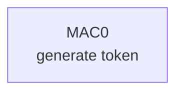
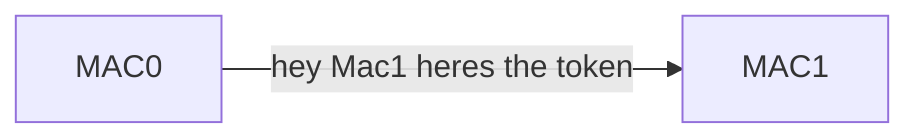
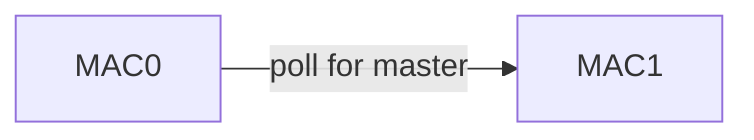
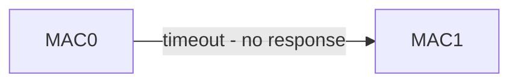
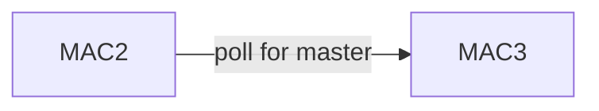

# How to do a packet capture for MSTP Networks
First  review the following RS-485 blog posts to understand how MSTP is a software protocol and most issues arrise with the electrical standard that it uses, RS-485.


----
This is a blog post series written by Rick Stehmeyer a long time ago explaining the hardware of BACnet MSTP: 
- [What-is-rs-485-part-1](https://buildingenergy.cx-associates.com/what-is-rs-485-part-1) - This has some oversimplifications of how the differential voltage encoding works, so its not 100% technically accurate, but it helps a reader understand how we take electricity and turn it into `1`s and `0`s for binary encoding. 
- [What-is-rs-485-part-2](https://buildingenergy.cx-associates.com/what-is-rs-485-part-2)
- [What-is-rs-485-part-3](https://buildingenergy.cx-associates.com/rs-485-part-3-red-flags-and-how-to-avoid-them) - This article has some common things to check on install when we have MSTP (or any RS-485) hardware communication problems. 
---

## Getting started
Now to perform a packet capture on a RS-485, you'll want two pieces of software which will use a USB to RS-485 serial adapter. 

### Software  
- You'll need Steve Kargs mstpcap.exe
	- https://steve.kargs.net/bacnet/bacnet-mstp-wireshark-live-capture/

	- [Download it from AE's sharepoint here](https://albireoenergy10.sharepoint.com/:u:/s/Operations/IQAGGmF7_hY8QqFaTv3TXzUSAX5iLEIQWBKsFTX4U5y4oMw?e=UuxHmu)
- You'll need wireshark
https://www.wireshark.org/

#### Hardware 
Any RS-485 serial adapter that will allow windows and wireshark to open a com port.
- Here is an example: [Advantech BB-USOPTL4](https://www.advantech.com/en-us/products/67a879ff-aef9-4715-8a4a-6c2763567851/bb-usoptl4/mod_f7c5f008-bf57-4b2b-8e42-603e788f3a4b)

## Process
1) Copy the [mstpcap.exe](https://albireoenergy10.sharepoint.com/:u:/s/Operations/IQAGGmF7_hY8QqFaTv3TXzUSAX5iLEIQWBKsFTX4U5y4oMw?e=UuxHmu) to the `C:\Program Files\Wireshark\extcap` folder.
2) Run wireshark. You should now see MSTP capture for BACNet on you the comm ports wireshark finds on your PC. It'll show something below your IP capture devices that should look like `BACnet MS/TP on COM3: COM3` as a capture interface. 
3) Click the little black setting icon which should look alike a gear ⚙️, to set your baud rate 
4) Double click on the com port to start the capture, make sure youre wired in parallel to a controller on the bus you'd like to evaluate 

## Running via Command prompt
Here is a sample of the tool running if you just run it in a command prompt (use CTRL-C to quit):
```dos
C:\bacnet\mstpcap.exe com5 38400`
Adjusted interface name to \\.\COM5
mstpcap: Using COM5 for capture at 38400 bps.
mstpcap: saving capture to mstp_20110413134119.cap
1156 packets
==== MS/TP Frame Counts ====
MAC     Device  Tokens  PFM     RPFM    DER     Postpd  DNER    TestReq TestRsp
0       -       188     4       0       0       0       0       0       0
2       -       189     0       0       0       0       0       0       0
3       -       189     9       0       0       0       0       0       0
7       -       189     60      0       0       0       0       0       0
35      -       188     140     0       0       0       0       0       0
Node Count: 5
 
==== MS/TP Usage and Timing Maximums ====
MAC     MaxMstr Retries Npoll   Self    Treply  Tusage  Trpfm   Tder    Tpostpd
0       1       0       52      0       11      24      0       0       0
2       0       0       0       0       23      0       0       0       0
3       6       0       50      0       5       100     0       0       0
7       34      0       52      0       5       34      0       0       0
35      127     0       50      0       6       63      0       0       0
Node Count: 5
Invalid Frame Count: 95
```
### What each of these headings means
---
There are two console based tables that populate as the packet capture progresses.  same for Frame counts and Usage/Timing Maximums)
- `MAC` = MAC address on the bus   
- `Node Count` = How many MSTP Devices were found on the wire
- `Invalid Frame Count` = how many Invalid data frames (the low level version of a "packet" on the RS-485 bus) that were detected via failed CRC checks. THIS IS AN IMPORTANT METRIC! 
---
- `Device` = Device ID when an I-Am is seen in a capture (trigger with Who-Is).
- `Tokens` = number of Token frames sent from this MAC address.
- `PFM` = number of Poll-For-Master frames sent from this MAC address.
- `RPFM` = number of Reply-To-Poll-For-Master frames sent from this MAC address.
- `DER` = number of Data-Expecting-Reply frames sent from this MAC address.
- `Postpd` = number of Reply-Postponed frames sent from this MAC address.
- `DNER` = number of Data-Not-Expecting-Reply frames sent from this MAC address.
- `TestReq` = number of Test-Request frames sent from this MAC address.
- `TestRsp` = number of Test-Response frames sent from this MAC address.
---
- `MaxMstr` = highest destination MAC address during the device's "Poll-For-Master"
- `Retries` = number of second tokens sent to this MAC address.
- `Npoll` = number of Tokens between Poll-For-Master
- `Self` = number of Tokens sent to self (BACnet Standard Addendum 135-2008v) and number of tardy tokens sent late.
- `Treply` = maximum number of milliseconds it took to reply with token after receiving a token. Treply is required to be less than 25ms (but the mstpcap tool may not have that good of resolution on Windows).
- `Tusage` = the maximum number of milliseconds the device waits for a ReplyToPollForMaster or Token retry. Tusage is required to be between 20ms and 100ms.
- `Trpfm` = maximum number of milliseconds to respond to PFM with RPFM.  It is required to be less than 25ms.
- `Tder` = maximum number of milliseconds that a device takes to respond to a DataExpectingReply request.  Tder is required to be less than 250ms.
- `Tpostpd` = maximum number of milliseconds to respond to DataExpectingReply request with ReplyPostponed.  Tpostpd is required to be less than 250ms.

## How to interpret the results
Using the example above these things should catch your eye:
```dos
==== MS/TP Usage and Timing Maximums ====
MAC     MaxMstr Retries Npoll   Self    Treply  Tusage  Trpfm   Tder    Tpostpd
0       1       0       52      0       11      24      0       0       0
2       0       0       0       0       23      0       0       0       0
3       6       0       50      0       5       100     0       0       0
7       34      0       52      0       5       34      0       0       0
35      127     0       50      0       6       63      0       0       0
Node Count: 5
Invalid Frame Count: 95
```
### Issues found
1) Non Contiguous device MAC addressing, `Node Count` is 5 but the addressing goes up to MAC 35! This introduces delay into the polling 
	- `Npoll` shows this delay 
2) `Invalid Frame Count: 95` - these are like "dropped packets", 

## Issues found explained:
### Non-Contiguous device MAC addressing 
- In Token Passing protocls like MSTP, we pass the "talking stick" aka the `token`, as follows

Device with `MAC0` generates the token on boot, and is usally your global controller (Like a  JACE, ACM, SNE, S-1000, BACnetIP Router, etc.).  It will make any network requests (like an AHU asking for OAT from the central plant controller).  These requests occur one at a time until the device with `MAC0` reaches its `max info frames` setting in the controller, then it updates its queue of data polls for peer-to-peer values it didnt get to, and passes the token to the `NEXT MAC ADDRESS`. 

**The Address Gap**: When an MS/TP master device receives the token, it knows its own MAC address and the address of its logical successor. If there is an empty address space between it and the next known master, it must occasionally check if a new device exists in that gap, this increments "PFM" or Poll for Master" 

**Timeout because there is no MAC1 on the bus**


**again**


Then we try the next address

This device sees the poll and grabs the token. it makes all its peer-to-peer requests from other bacnet devices up to `max info frames` and then passes the token.   

and because `MAC3` is there, we dont see PFM increment above! 
### what to fix when we have Non-Contiguous device MAC addressing 
- Readdress all your devices, with the manufacturer reccomended starting MAC address (for JCI MSTP networks this is MAC4) so they are contiguous from that address until the last device on the network.
	- Once this is done, make sure you set your `Max master` setting in all your controllers to be equal to the last device address OR the last device address +1 (remember every empty address adds latency to the network as the token trys to reach a controller that doesnt exist). 
  
- What is max master? Max Master is a configuration parameter in BACnet MS/TP that defines the highest MAC address that the token-passing algorithm will poll when searching for new master nodes on the bus. It limits the range of addresses the token-passing process checks, so setting it to the actual highest master address on the network reduces unnecessary token-passing overhead and speeds up recovery time when a device goes offline. 
  
  💡 Keeping Max Master as low as possible while still covering all master devices on the segment is considered best practice for optimizing network efficiency.

### Non-Zero Invalid Frames Count

BACnet MSTP frames are the packets of data on the wire.  Since Its a serial network, we actually dont use Packets (because Packets get embedded in frames on the TCP stack). 

BACnet MSTP Frames look like this in terms of bytes:

```
┌──────────┬──────────┬────────────┬─────────────┬────────────┬─────────────┬─────────────┐
│  0x55    │  0xFF    │ Frame type │ Dest address│ Src address│ Data length │ Header CRC  │
│Preamble 1│Preamble 2│  1 byte    │   1 byte    │   1 byte   │   2 bytes   │   1 byte    │
└──────────┴──────────┴────────────┴─────────────┴────────────┴─────────────┴─────────────┘
╔══════════════════════════════════════════════════════════════════════════════════════════╗
║                         Data — 0 to 501 bytes (optional)                                 ║
║                        Present only when data length > 0                                 ║
╚══════════════════════════════════════════════════════════════════════════════════════════╝
┌──────────────────────────────────────────────────────────────────────────────────────────┐
│                    Data CRC — 2 bytes (present only when data length > 0)                │
└──────────────────────────────────────────────────────────────────────────────────────────┘
```
**Minimum frame:** 8 bytes (header only)  
**Maximum frame:** 511 bytes (8 header + 501 data + 2 data CRC)
Using this as an example: 


can you reformat this using byte numbering in decimal?
The important thing to focus on here is the "CRC" - which stands for **Cyclic Redundancy Check** on a serial network frame. It is an error-detecting mathematical checksum appended to the end of a data transmission. It verifies that the frame arrived exactly as it was sent without accidental bit changes caused by physical noise or hardware faults.  

Remember we saw: 
```
Invalid Frame Count: 95
```  
with our packet capture, this means we had noise on our wire that caused Frames to fail their CRC.  The Packet cature detects this and reports how many times the actual electrical signal on the wire fails to convey a complete packet. 
**this is an indicator of phsyical installation problems!**
### Things to now check
- RS-485 segment is grounded on one end and no other places on the network (refer to  [What-is-rs-485-part-3](https://buildingenergy.cx-associates.com/rs-485-part-3-red-flags-and-how-to-avoid-them) for a technique to make this easy) - always follow the manufacturer's reccomendations here
- Ensure your have at least one EOL terminator (120 ohms or device integrated dip switch) active on one end of the bus
	- if you have two already in place, sometimes they can drop the voltage of the network, so try removing ONLY one. 
- Correct wire type, guage, and contiguous shielding for the entire segment
- All devices have their BAUD rates set the same (autobaud can sometimes fail and cause CRC errors)
- All devices are properly grounded per the manufacturer's instructions. 
