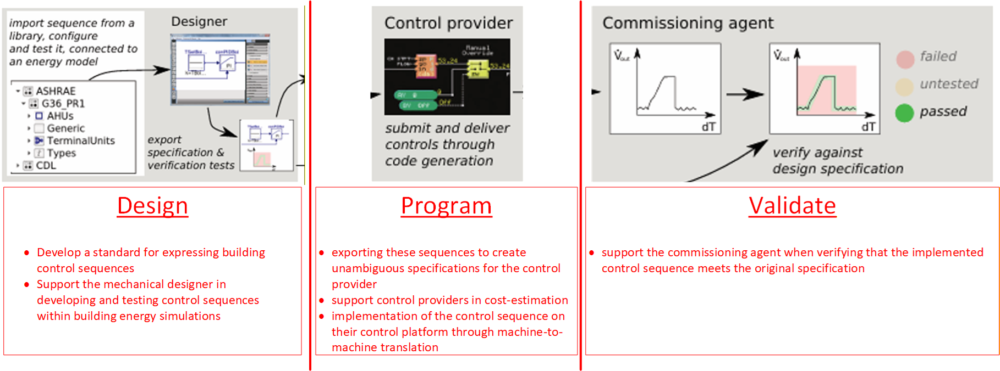

# Enoch Rick's ASHRAE 231P - CDL notes and Opinions 

Everything below is my notes on ASHRAE 231P "A Control Description Language" (or CDL for short), its intent and what it can become / should be.  These are my own musings and are <ins>not be interpreted as related to the CDL project or ASHRAE in any official context</ins>.  I am simply cataloging information in this doc and the others linked there in for my own purposes and and mental refinement which I hope to use to contribute to the project eventually. I will summerize starting from the original paper (below) which kicked off most of my oppinions and thoughts on this project and its benefits for the HVAC Automation industry as a whole.  

From [the original paper on CDL](https://simulationresearch.lbl.gov/wetter/download/2018-americanModelica-WetterGrahovacHu.pdf)
### Intro:
"_The purpose of this paper is to describe a first implementation of 	<ins>a language with the intent to develop a standard for expressing building control sequences</ins>. This standard should support the mechanical designer in developing and testing control sequences within building energy simulations, and exporting these sequences to create unambiguous specifications for the control provider. It should support control providers in cost-estimation and in implementation of the control sequence on their control platform through machine-to-machine translation, and it should support the commissioning agent when verifying that the implemented control sequence meets the original specification._"

## Key points:
- develop a standard for expressing building control sequences
- support the mechanical designer in developing and testing control sequences within building energy simulations
- exporting these sequences to create unambiguous specifications for the control provider
- support control providers in cost-estimation
- implementation of the control sequence on their control platform through machine-to-machine translation
- support the commissioning agent when verifying that the implemented control sequence meets the original specification

This image from [the original paper on CDL](https://simulationresearch.lbl.gov/wetter/download/2018-americanModelica-WetterGrahovacHu.pdf) Wetter, M., Grahovac M., Hu J.
  Control Description Language,
  Lawrence Berkeley National Laboratory

<ins>Stakeholders:</ins>
- Mechanical Desinger - MEP PE workflows
- Constrols provider sales - System integrator bidding workflows
- Controls Provider programmer - System integrator programming / startup and turnover workflows
- Commissioning Agent - Validation and verification worflows

### CDL needs to satisfy these high level requirements:
- It must be independent of any control-vendor specific platform.
- It must be declarative to facilitate its translation to other languages.
- It must be possible to simulate controls expressed in the language within an annual building energy simulation.
- It must be deterministic, e.g., for given inputs and states, different implementations of sequences expressed must yield the same output and state updates (within the precision of ordinary differential equation solvers that may integrate PID controllers).
- It should be possible to translate the sequence to a variety of building control platforms.
- It must allow identification of cyclic graphs that would require iterative solutions and hence are not suited for implementation in building automation systems.

### Relevant Links
- [Open Building control Website](https://obc.lbl.gov/)
- [OpenBuildingControl: Digitizing the control delivery from building energy modeling to specification, implementation and formal verification, Wetter M., Ehrlich, P. Gautier, A. Grahovac, M. Haves P., Hu J., Prakash A., Robin D., Zhang K,.](https://www.sciencedirect.com/science/article/pii/S0360544221017497?via%3Dihub)
- [Buildings Controls OBC UsersGuide](https://build.openmodelica.org/Documentation/Buildings.Controls.OBC.UsersGuide.html)
- [Open Modelica](https://openmodelica.org/)

### thoughts on open Modelica
- install is full of extract operations for a lot of small files which makes the installation time SUPER long even on a modern high end PC - ask me how i know ;-) 
